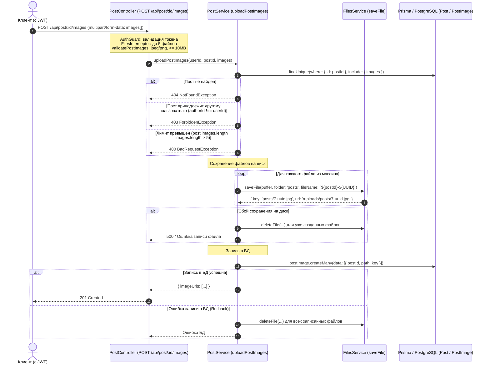

# Руководство по сохранению изображений постов (One-to-Many)

## Назначение документа

Данный документ объясняет архитектуру и детали реализации сохранения изображений для постов:

1. Архитектурное различие между утилитарным методом множественной загрузки `ImageService.saveImages` и доменным методом `PostService.uploadPostImages`.
2. Связь One-to-Many (Один ко многим) между постом (`Post`) и его изображениями (`PostImage`) в базе данных PostgreSQL и схеме Prisma.
3. Полный жизненный цикл загрузки картинок к посту: аутентификация, валидация, проверка владения постом, сохранение файлов, запись в БД и транзакционный откат при сбоях.

---

## 1. Сравнение ImageService.saveImages vs PostService.uploadPostImages

В проекте реализованы две разные концепции работы с несколькими изображениями:

| Параметр                      | `ImageService.saveImages`                                                                                                | `PostService.uploadPostImages`                                                                                   |
| ----------------------------- | ------------------------------------------------------------------------------------------------------------------------ | ---------------------------------------------------------------------------------------------------------------- |
| **Файлы реализации**          | [src/image/image.service.ts](src/image/image.service.ts), [src/image/image.controller.ts](src/image/image.controller.ts) | [src/post/post.service.ts](src/post/post.service.ts), [src/post/post.controller.ts](src/post/post.controller.ts) |
| **HTTP эндпоинт**             | `POST /api/image/multiple`                                                                                               | `POST /api/post/:id/images`                                                                                      |
| **Назначение**                | Утилитарное сохранение произвольного пакета файлов без ресайза на диск.                                                  | Бизнес-операция прикрепления картинок к конкретному посту.                                                       |
| **Связь с базой данных**      | **Нет**. Не сохраняет записей в БД.                                                                                      | **Да**. Создает записи в таблице `post_images` со связью One-to-Many.                                            |
| **Проверка прав автора**      | Нет привязки к ресурсу.                                                                                                  | **Строгая проверка**: загружать картинки может только автор поста (`post.authorId === userId`).                  |
| **Лимиты картинок**           | Ограничено только параметрами multer.                                                                                    | Максимум 5 картинок в одном запросе и **суммарно не более 5 картинок у одного поста**.                           |
| **Именование файлов**         | `${randomUUID()}.${ext}`                                                                                                 | `${postId}-${randomUUID()}.${ext}`                                                                               |
| **Папка сохранения**          | `uploads/${folder                                                                                                        |                                                                                                                  | 'img'}/` | `uploads/posts/` (через `FilesService`) |
| **Откат при сбое (Rollback)** | Нет.                                                                                                                     | **Да**: при ошибке записи в БД или на диск все новые файлы запроса удаляются.                                    |

---

## 2. Связь One-to-Many в схеме Prisma

В [prisma/schema.prisma](prisma/schema.prisma#L65) связь между постом и его изображениями реализована через отношение **1 ко многим**:

```prisma
model Post {
  id        Int         @id @default(autoincrement())
  title     String
  content   String?
  published Boolean?    @default(false)
  imagePath String?     @map("image_path") // устаревшее скалярное поле для обратной совместимости
  author    User?       @relation(fields: [authorId], references: [id], onDelete: SetNull)
  authorId  String?     @map("author_id")

  // Связь One-to-Many: у одного поста может быть массив связанных картинок (до 5 штук)
  images    PostImage[]
  ...
}

// Отдельная таблица post_images для хранения путей к изображениям
model PostImage {
  id        String   @id @default(uuid())
  path      String   // относительный путь на диске: "posts/7-f4f36273-3ab8-4b6a-b495-e6df2f3678cd.jpg"
  postId    Int      @map("post_id")
  post      Post     @relation(fields: [postId], references: [id], onDelete: Cascade)

  createdAt DateTime @default(now()) @map("created_at")
  updatedAt DateTime @updatedAt @map("updated_at")

  @@index([postId], name: "idx_post_images_post_id")
  @@map("post_images")
}
```

### Преимущества такого подхода:

- **Нормализация данных**: пути к файлам хранятся отдельными записями, что позволяет легко добавлять, удалять или переупорядочивать отдельные картинки.
- **Каскадное удаление (`onDelete: Cascade`)**: при удалении поста из базы данных (`DELETE /api/post/:id`) все связанные записи из `post_images` удаляются автоматически на уровне СУБД.
- **Очистка диска при удалении поста**: в `PostService.deletePost` после успешного удаления поста из базы данных запускается физическое удаление всех связанных файлов картинок с диска через `FilesService.deleteFile`, предотвращая появление сиротских файлов.
- **Индексация**: индекс `@@index([postId])` обеспечивает мгновенную выборку картинок при запросе поста по ID или при получении ленты постов.

---

## 3. Схема работы PostService.uploadPostImages



---

## 4. Пошаговый алгоритм метода `uploadPostImages`

### 1. Валидация запроса в `PostController`

В [src/post/post.controller.ts](src/post/post.controller.ts#L88):

- `@UseGuards(AuthGuard)` проверяет JWT токен и извлекает `req.user.id`.
- `FilesInterceptor('images', 5)` извлекает массив бинарных файлов из поля `images`.
- Вспомогательный метод `validatePostImages`:
  - Проверяет, что передан хотя бы один файл (`images.length > 0`).
  - Проверяет, что в запросе не более 5 файлов (`images.length <= 5`).
  - Проверяет MIME-тип каждого файла (`image/jpeg` или `image/png`).
  - Проверяет размер каждого файла (не более `MAX_UPLOAD_SIZE_MB`, по умолчанию 10 МБ).

### 2. Бизнес-проверки в `PostService`

В [src/post/post.service.ts](src/post/post.service.ts#L153):

1. **Существование поста**: `prismaService.post.findUnique` запрашивает пост вместе со списком уже существующих картинок (`images`). Если поста нет — выбрасывается `NotFoundException (404)`.
2. **Проверка прав автора**: сравнивается `post.authorId === userId`. Если ID не совпадают — выбрасывается `ForbiddenException (403)`.
3. **Лимит картинок у поста**: проверяется условие `post.images.length + images.length > MAX_IMAGES_PER_POST` (5). Если лимит превышен — выбрасывается `BadRequestException (400)`.

### 3. Сохранение файлов на диск через `FilesService`

- Имя файла генерируется по маске `${postId}-${randomUUID()}.${ext}`.
- Файлы сохраняются в директорию `uploads/posts/`.
- Если при сохранении любого файла из пачки возникает ошибка — срабатывает блок `catch`, который удаляет все файлы текущего запроса, уже успевшие записаться на диск.

### 4. Создание записей в базе данных

- Вызывается `prismaService.postImage.createMany({ data: [...] })`.
- В таблицу `post_images` записываются строки с `postId` и относительным путем `path` (`posts/7-<uuid>.jpg`).
- **Транзакционный откат**: если вызов `createMany` завершился ошибкой (например, сбой соединения с PostgreSQL), блок `catch` удаляет все только что записанные файлы с диска, исключая появление "сиротских" (orphan) файлов.

---

## 5. Как устроен метод `saveImages` в `ImageService`

В [src/image/image.service.ts](src/image/image.service.ts#L69):

```typescript
async saveImages(
  files: Express.Multer.File[],
  folder?: string,
): Promise<ImageResponse[]> {
  const uploadedFolder = resolve(process.cwd(), 'uploads', folder || 'img');
  await ensureDir(uploadedFolder);

  const results = await Promise.all(
    files.map(async (file) => {
      const imageName = `${randomUUID()}${extname(file.originalname).toLowerCase()}`;
      const fullPath = join(uploadedFolder, imageName);
      await fs.writeFile(fullPath, file.buffer);
      return {
        name: imageName,
        url: `/${folder || 'img'}/${imageName}`,
      };
    }),
  );

  return results;
}
```

### Отличия от `saveImage` (single) и от `uploadPostImages`:

1. В отличие от `saveImage(file)`: метод `saveImages` **не** делает ресайз через Sharp, а сохраняет оригинальные буферы файлов (`file.buffer`).
2. В отличие от `uploadPostImages`: метод `saveImages` является утилитарным и **не взаимодействует с базой данных**, не проверяет посты и авторство. Он подходит для загрузки статичных ассетов общего назначения.

---

## 6. Управление картинками при редактировании поста

При редактировании поста исключается накопление мусорных (сиротских) файлов на диске:

1. **Удаление отдельной картинки поста**:
   - `DELETE /api/post/:id/images/:imageId`
   - Проверяется авторство поста, запись удаляется из `post_images`, а связанный файл удаляется с диска через `FilesService.deleteFile`.
2. **Замена конкретной картинки поста**:
   - `PUT /api/post/:id/images/:imageId` (multipart/form-data с файлом `image`)
   - Проверяется авторство поста. Новый файл сохраняется на диск, обновляется путь в таблице `post_images`, а старый файл физически удаляется с диска. В случае сбоя БД новый файл откатывается.
3. **Удаление картинок через обновление поста**:
   - `PUT /api/post/:id` или `PATCH /api/post/:id` с полем `removeImageIds: string[]` в `UpdatePostDto`.
   - Записи удаляются из `post_images`, а соответствующие файлы удаляются с диска.
   - Если заменяется или очищается `imagePath`, старый файл также удаляется.
4. **Добавление картинок**:
   - `POST /api/post/:id/images` (до 5 картинок суммарно у поста).
