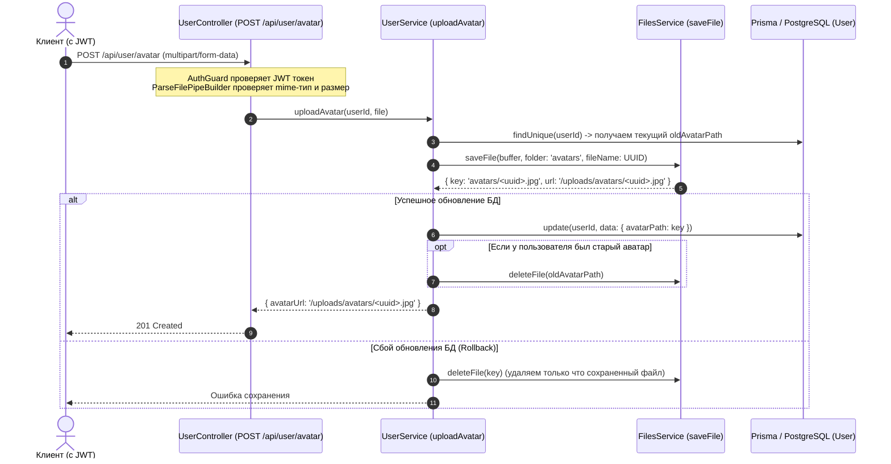

# Архитектура и процесс сохранения аватара пользователя (One-to-One)

## Назначение документа

Данный документ подробно описывает, как в приложении устроена работа с аватарами пользователей:

1. Архитектурное разграничение между общим модулем изображений (`ImageModule`) и доменным аватаром (`UserModule` + `FilesModule`).
2. Как реализована связь One-to-One (один пользователь — один аватар) на уровне базы данных PostgreSQL и Prisma.
3. Полный жизненный цикл загрузки, замены, отката и удаления старого файла аватара.

---

## 1. Разграничение ImageService vs UserService

В проекте присутствуют два сервиса, работающие с изображениями, решающие разные задачи:

| Сервис / Контроллер                                                                                                       | Эндпоинт                 | Назначение                                                                       | Связь с БД                                                                          |
| ------------------------------------------------------------------------------------------------------------------------- | ------------------------ | -------------------------------------------------------------------------------- | ----------------------------------------------------------------------------------- |
| [src/image/image.service.ts](src/image/image.service.ts) / [src/image/image.controller.ts](src/image/image.controller.ts) | `POST /api/image/single` | Общая утилитарная загрузка картинки с ресайзом ($320 \times 240$ через Sharp).   | **Нет**. Сохраняет файл на диск, не знает о пользователях и не меняет `avatarPath`. |
| [src/user/user.service.ts](src/user/user.service.ts) / [src/user/user.controller.ts](src/user/user.controller.ts)         | `POST /api/user/avatar`  | Загрузка и привязка персонального аватара текущего авторизованного пользователя. | **Да**. Обновляет поле `avatarPath` в таблице `users`.                              |

---

## 2. Связь One-to-One в базе данных

В [prisma/schema.prisma](prisma/schema.prisma#L24) модель `User` содержит скалярное поле:

```prisma
model User {
  id         String   @id @default(uuid())
  email      String   @unique
  password   String
  role       Role     @default(GUEST)
  name       String?
  avatarPath String?  @map("avatar_path")
  ...
}
```

### Почему это связь One-to-One:

- Поле `avatarPath` хранится напрямую в строке конкретного пользователя в таблице `users`.
- У каждой записи пользователя есть ровно одно значение `avatarPath` (путь к текущему активному аватару либо `null`).
- При сохранении нового аватара старое значение в поле перезаписывается, что исключает дублирование или множественные аватары для одного пользователя.

---

## 3. Схема процесса загрузки аватара



---

## 4. Пошаговый сценарий работы

### Шаг 1: Прием и валидация запроса

В [src/user/user.controller.ts](src/user/user.controller.ts#L60):

- Эндпоинт защищен `@UseGuards(AuthGuard)`. Идентификатор пользователя извлекается из `req.user.id`.
- `FileInterceptor('avatar')` парсит multipart-запрос.
- `ParseFilePipeBuilder` проверяет, что файл является изображением `image/jpeg` или `image/png`, и его размер не превышает допустимый лимит (`AVATAR_MAX_FILE_SIZE_BYTES`).

### Шаг 2: Поиск пользователя и запоминание старого файла

В [src/user/user.service.ts](src/user/user.service.ts#L70):

- `findUnique` проверяет существование пользователя.
- Запоминается `oldAvatarPath = user.avatarPath` для последующей очистки.

### Шаг 3: Физическое сохранение файла

- Вызывается [src/files/files.service.ts](src/files/files.service.ts) с параметром `folder: 'avatars'` и именем файла на базе случайного `UUID()`.
- Использование UUID гарантирует уникальность и предотвращает кеширование старого изображения браузером при замене.
- Файл сохраняется локально в директорию `uploads/avatars/`.

### Шаг 4: Обновление записи в БД

- Выполняется `prismaService.user.update` с обновлением поля `avatarPath: storedAvatar.key`.
- **Защита от сиротских файлов (Rollback)**: Если при обращении к БД возникает ошибка, блок `catch` немедленно удаляет только что созданный файл через `filesService.deleteFile(storedAvatar.key)`.

### Шаг 5: Очистка старого аватара

- Если в базе данных ранее был записан `oldAvatarPath`, и он отличается от нового ключа, сервис удаляет старый файл с диска.
- Если удалить старый файл не удалось (например, он был удален вручную), ошибка логируется через Logger, но клиент не получает ошибку, так как новый аватар уже успешно привязан.

---

## 5. Получение и раздача аватара

1. **Получение URL аватара (`GET /api/user/avatar`)**:
   - В [src/user/user.service.ts](src/user/user.service.ts#L135) метод `getAvatar` находит пользователя и преобразует относительный ключ `avatarPath` в публичный URL через `filesService.getPublicUrl(user.avatarPath)`.
2. **Раздача статики**:
   - В [src/main.ts](src/main.ts) настроена раздача статических файлов из директории `uploads/` по префиксу `/uploads/`.
   - В результате аватар доступен клиенту по ссылке: `/uploads/avatars/<uuid>.jpg`.
